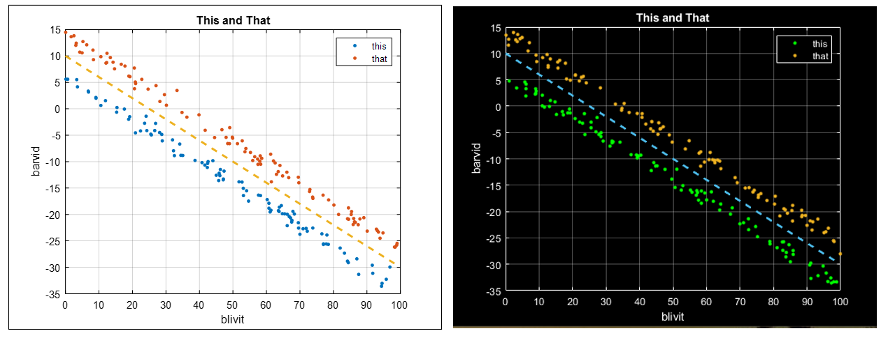
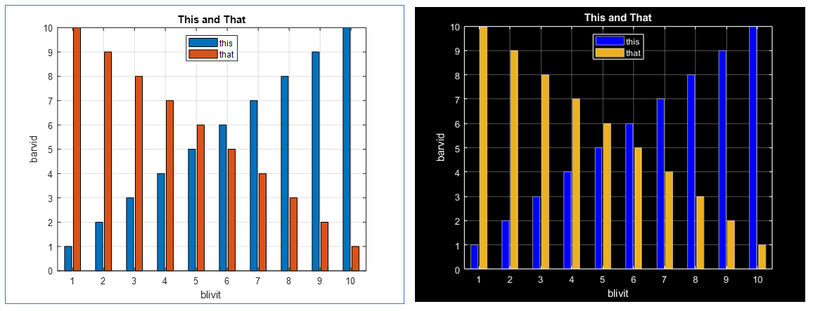
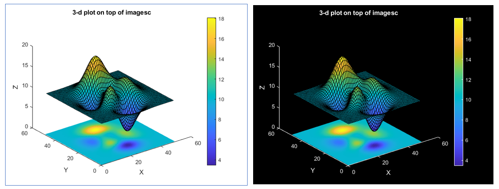
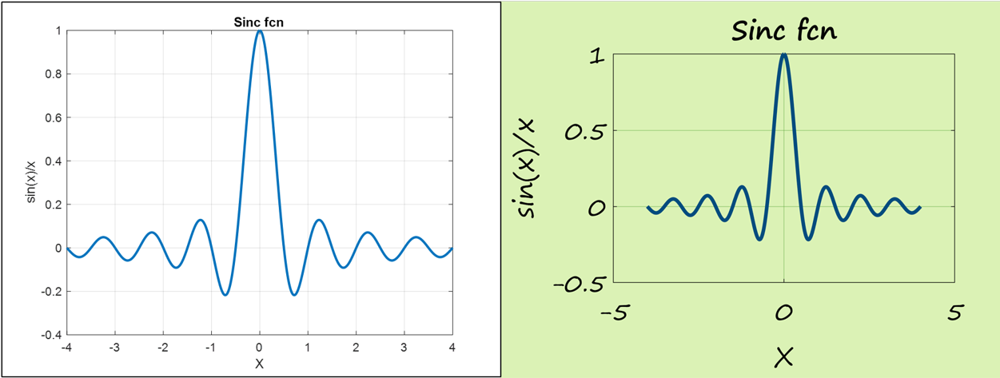

# Easily create dark-themed plots in MATLAB and GNU Octave

NEW! Render plots in an _xkcd_-like hand-drawn theme using HAND.M.

DARK converts standard light-themed plots to a dark color scheme. DARK is easy to use, simply run the command "dark" and the current plot will be rendered in a dark theme. DARK is compatible with MATLAB and GNU Octave.

DARK uses only native functions common to MATLAB and GNU Octave without any dependencies on toolboxes or packages. Because of this it will likely run on most any version. It's been tested with MATLAB versions R2019b, R2020b, R2022b, and R2023b as well as GNU Octave versions 3.8.2, 4.4.0, 5.2.0, 6.4.0, 8.3.0, and 9.1.0. DARK has been tested on Windows 10 and Linux distros running Centos7, RHEL 8, and Ubuntu 22.04.

UNDARK restores a dark-themed plot back to its standard light theme. Running the command "undark" will restore the current plot to its standard light theme. In short UNDARK undoes DARK.

HAND renders a plot in an _xkcd_-like theme. It's been tested with MATLAB R2023b and GNU Octave versions 5.2.0, 6.4.0, 8.3.0, and 9.1.0 running on Windows 10 as well as Linux RHEL 8 and Ubuntu 22.04. For running on Linux, HAND bundles the excellent "xkcd Script" font from [xkcd-font](https://github.com/ipython/xkcd-font). Under Windows HAND uses the "Segoe Print" font included with all Windows 7, 8, 10 and 11 distributions. Similar to DARK, HAND is coded using funtions native to MATLAB and GNU Octave without any dependencies on toolboxes or packages, making it highly portable.

# Files
* hand.m - NEW - Convert plot to a hand-drawn theme
% test_hand.m - NEW - Test for hand.m
* dark.m - Convert plot to a dark color theme
* undark.m - Convert dark theme plot back to the standard light theme
* test_dark.m - Test dark.m with several plot types
* test_undark.m - Test undark.m with several plot types

# Examples
### 1. Make a simple dark themed line plot

~~~~
plot(1:10); dark
~~~~

### 2. Convert an annotated multi-data-series bar plot to a dark theme. Draw blue bars for the first series and peach bars for the second.

~~~~
bar([(1:10)' (10:-1:1)']);
grid on;
legend('this','that','Location','North');
xlabel('Blivit');
ylabel('Barvid');
title('This and That');
dark('bp')
~~~~

### 3. Render a simple line plot in a hand-lettered theme.

~~~~
x = (-1024:1024)/256 * 2*pi;
plot(x/(2*pi), sin(x) ./ x);
grid on;
xlabel('X');
ylabel('sin(x)/x');
title('Sinc fcn');
hand
~~~~

# Citation
1. **[xkcd-font](https://github.com/ipython/xkcd-font)**  

> Written with [StackEdit](https://stackedit.io/).
