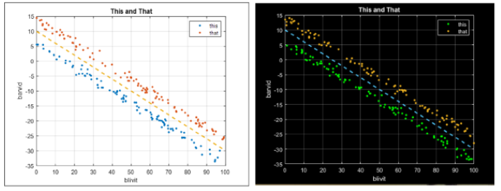
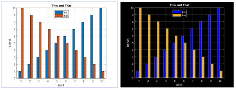
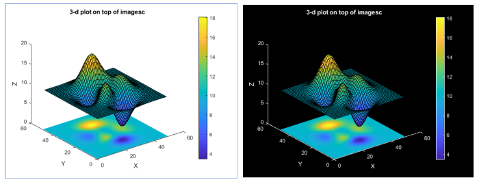
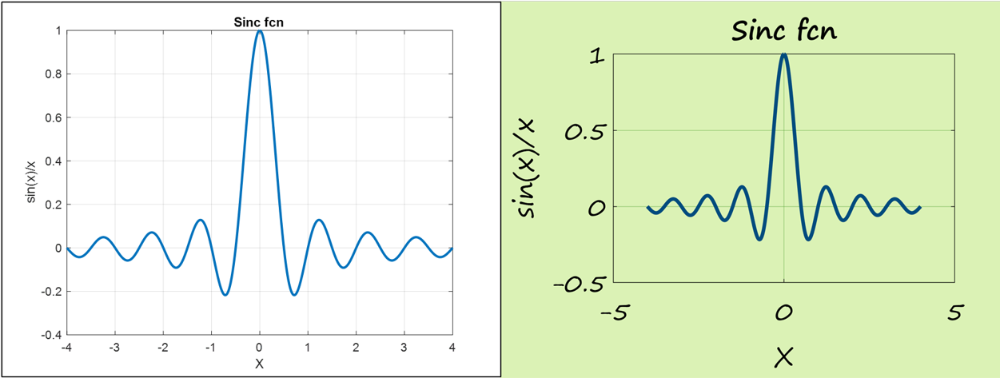
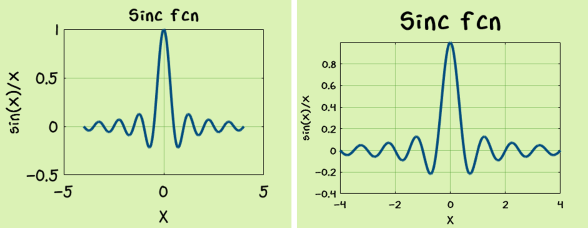

# Easily create plots with dark and hand-drawn themes in MATLAB and GNU Octave

```DARK``` converts a standard light-themed plot to a dark color scheme. ```DARK``` is easy to use, simply run the command "dark" on your current plot to render it in a dark theme. Once converted you may continue to manipulate the plot as desired including zooming, panning, and modifying properties.

```DARK``` uses only native functions common to MATLAB and GNU Octave without any dependencies on toolboxes or packages. Because of this it will likely run on most any version. It's been tested with MATLAB versions R2019b, R2020b, R2022b, and R2023b as well as GNU Octave versions 3.8.2, 4.4.0, 5.2.0, 6.4.0, 8.3.0, and 9.1.0. ```DARK``` has been tested on Windows 10 and Linux distros running Centos7, RHEL 8, and Ubuntu 22.04.

```UNDARK``` restores a dark-themed plot back to its standard light theme. Running the command "undark" will restore the current plot to its standard light theme. In short ```UNDARK``` undoes ```DARK```.

```HAND``` renders a plot in a theme that emulates a hand-drawn plot in an engineering notebook. It works the same way as ```DARK```, simply run the command "hand" on your current plot to render it in a hand-drawn theme. Once converted you may continue to modify properties, zoom, and pan as desired.

```HAND``` has been tested with MATLAB R2023b and GNU Octave versions 5.2.0, 6.4.0, 8.3.0, and 9.1.0 running on Windows 10 as well as Linux RHEL 8 and Ubuntu 22.04. For running on Linux, ```HAND``` bundles the excellent "xkcd Script" font from [xkcd-font](https://github.com/ipython/xkcd-font). When running on Windows, ```HAND``` uses the "Segoe Print" font included with all modern Windows distributions. Similar to ```DARK```, ```HAND``` is coded using functions native to MATLAB and GNU Octave without any dependencies on toolboxes or packages, making it highly portable.

```FONT_ADJUSTER``` makes it easy to change the size of various text fields displayed on a plot. Separate controls are provided for the title, axes labels, axes tick numbers, and legend. It also provides a control for setting the type of font displayed to any installed font on the system. See ```help font_adjuster``` for detailed usage.

# Files
* font_adjuster.m - NEW - Easily adjust fonts on plots (title, axes, legend, ticks)
* test_font_adjuster.m - NEW - Test for font_adjuster.m
* hand.m - Convert plot to a hand-drawn theme
* test_hand.m - Test for hand.m
* dark.m - Convert plot to a dark color theme
* undark.m - Convert dark theme plot back to the standard light theme
* test_dark.m - Test dark.m with several plot types
* test_undark.m - Test undark.m with several plot types
* xkcd-script.ttf - NEW - xkcd Script font from [xkcd-font](https://github.com/ipython/xkcd-font)









Additional sample plots can be found in the samples folder.

# Examples
### 1. Make a simple dark themed line plot

~~~~
plot(1:10); dark
~~~~

### 2. Convert an annotated multi-data-series bar plot to a dark theme. Draw blue bars for the first series and peach bars for the second.

~~~~
bar([(1:10)' (10:-1:1)']);
grid on;
legend('this','that','Location','North');
xlabel('Blivit');
ylabel('Barvid');
title('This and That');
dark('bp')
~~~~

### 3. Render a simple line plot in a hand-written theme.

~~~~
x = (-1024:1024)/256 * 2*pi;
plot(x/(2*pi), sin(x) ./ x);
grid on;
xlabel('X');
ylabel('sin(x)/x');
title('Sinc fcn');
hand
~~~~

### 4. Starting with the plot of example 3, use ```font_adjuster``` to adjust the title and axes fonts.

~~~~
% First read the current font sizes and font name
[ti,la,tc,le,na] = font_adjuster(gca);

% The title is a bit too small and axes fonts too large. Let's increaase the title font size by 10 points and descrease the axes label and ticks fonts by 8 points
[ti,la,tc,le,na] = font_adjuster(gca,ti+10,la-8,tc-8);
~~~~



# Citation
1. **[xkcd-font](https://github.com/ipython/xkcd-font)**  

> Written with [StackEdit](https://stackedit.io/) and [Obsidian Markdown](https://obsidian.md/)  .
