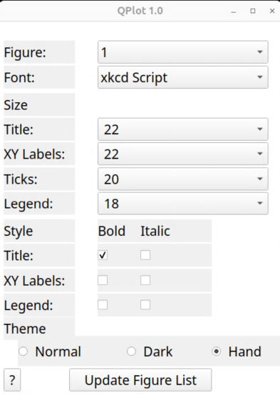
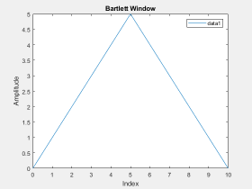
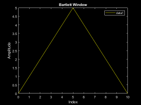
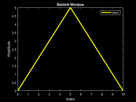
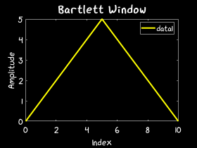
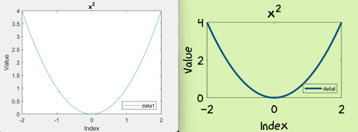

# Easily create plots with dark and hand-drawn themes in MATLAB and GNU Octave


The ```DARK``` project evolved from a single dark-themed plot utility to a full-featured set of tools for seamlessly manipulating the appearance of MATLAB and GNU Octave plots. ```DARK``` now consists of the following tools.

```dark.m```, the original function, converts a plot to a dark theme.  
```undark.m``` reverts a plot to its standard light theme.  
```hand.m``` renders a plot in a hand-drawn *xkcd*-like theme.  
```liner.m``` adjusts the width of plotted lines
```font_adjuster.m``` provides independent control of plot fonts and sizes.  
```qplot.m``` is a graphical user interface (GUI) to the functions in ```DARK```

The command line themes are surprisingly easy to use: After creating a plot as usual, simply run the command ```dark```, ```undark```, or ```hand``` and the current plot will be rendered accordingly.

```liner``` is a simple utility to get or set the width of plotted lines.

```font_adjuster``` is only slightly more advanced: Provide font sizes for the title, x-y axes, axes ticks, legend, and a font name, along with a handle to the figure axis you wish to modify and ```font_adjuster``` will apply the specified fonts and sizes.

Or skip the typing and use the ```qplot``` GUI to set the theme, font, and text size all in one place.



Each utility contains a detailed help description in the source file for those interested in all the intricacies and advanced usage.

The utilities in ```DARK``` use only native functions common to both MATLAB and GNU Octave without any dependencies on toolboxes or packages. Because of this they will likely run on most any version. It's been tested with MATLAB versions R2024b, and R2025b as well as GNU Octave versions  5.2,  8.4, 10.1, and 11.1. ```DARK``` has been tested on Windows 10 and 11, and Linux distros running RHEL 8, and Ubuntu 24.04.

On a personal note, ```DARK``` was born out of my own need for plots with better visual clarity. As I've developed serious vision issues in recent years, the standard light theme became too painful to look at and the default text too small to read. So I wrote ```dark.m``` and it's become my go-to tool for pretty much everything I plot. If ```DARK``` helps you work more efficiently, or if you'd like to see a feature added, I'd like to hear from you. Drop me a review on the MathWorks file exchange.

# Files
* qplot.m - NEW - Graphical front end to ```DARK``` utilities
* font_adjuster.m - NEW - Easily adjust fonts on plots (title, axes, legend, ticks)
* test_font_adjuster.m - NEW - Test for font_adjuster.m
* hand.m - Convert plot to a hand-drawn theme
* test_hand.m - Test for hand.m
* dark.m - Convert plot to a dark color theme
* undark.m - Convert dark theme plot back to the standard light theme
* test_dark.m - Test dark.m with several plot types
* test_undark.m - Test undark.m with several plot types
* xkcd-script.ttf - xkcd Script font from [xkcd-font](https://github.com/ipython/xkcd-font)

# Examples
### 1. Make a simple dark themed line plot

Start with a basic line plot.
~~~~
plot(0:10,[0:5 4:-1:0]);
xlabel('Index'); ylabel('Amplitude'); title('Bartlett Window'); legend('data1');
~~~~


Render in "dark" mode.
~~~~
dark
~~~~


Now let's make that line really stand out by setting its width to 3 points.
~~~~
liner(3);
~~~~


Finally, let's add some style (and size) to the fonts.
~~~~
% get the current font and sizes
[ti0,la0,tc0,le0,na0] = font_adjuster(gca);

% kick it up a notch
% switch font to 'xkcd script'
% increase title size by 14 points, and labels, axes, legend by 8 points
[ti,la,tc,le,na] = font_adjuster(gca,ti0+14,la0+8,tc0+8,le0+8,'xkcd script');
~~~~


### 2. Use QPlot to render a hand-drawn theme

~~~~
plot(-2:0.1:2,(-2:0.1:2).^2);
legend('data1')
xlabel('Index')
ylabel('Value');
title('x^2');
qplot
% Use the controls to set the theme to "hand"
~~~~


### 3. Convert an annotated multi-data-series bar plot to a dark theme. Draw blue bars for the first series and peach bars for the second.

~~~~
bar([(1:10)' (10:-1:1)']);
grid on;
legend('this','that','Location','North');
xlabel('Blivit');
ylabel('Barvid');
title('This and That');
dark('bp')
~~~~


### 4. Render a simple line plot in a hand-drawn theme.

~~~~
x = (-1024:1024)/256 * 2*pi;
plot(x/(2*pi), sin(x) ./ x);
grid on;
xlabel('X');
ylabel('sin(x)/x');
title('Sinc fcn');
hand
~~~~

### 5. Starting with the plot of example 3, use ```font_adjuster``` to adjust the title and axes fonts.

~~~~
% First read the current font sizes and font name
[ti,la,tc,le,na] = font_adjuster(gca);

% The title is a bit too small and axes fonts too large. Let's increaase the title font size by 10 points and descrease the axes label and ticks fonts by 8 points
[ti,la,tc,le,na] = font_adjuster(gca,ti+10,la-8,tc-8);
~~~~


# QPlot tips and hints
* When using GNU Octave, make sure to set the graphics toolkit to "qt". Enter `graphics_toolkit()` at the octave prompt to get the current setting and `graphics_toolkit("qt")` to configure for "qt". We recommend adding this command to your octave startup file.
* When using GNU Octave on a linux system running Wayland graphics protocol (this includes most every current distribution) we strongly recommend using `xcb`, Wayland's X11 backend. This can be accomplished by adding the following line to your .bashrc file:
	* `export QT_QPA_PLATFORM=xcb`
* When using GNU Octave, selecting figure number, font type, and size is most easily done by hovering your mouse cursor over the dropdown and using the mouse scroll wheel. Mouse clicking works but is not necessary.
* With MATLAB, you must click the dropdown then scroll to find your selection.
* On exit, QPlot remembers its last window position and size.
* If QPlot launches off screen (for whatever reason) use `qplot('fresh')` to launch the app window in its default position and size.

# More Samples


Additional sample plots can be found in the samples folder.

# Citation
1. **[xkcd-font](https://github.com/ipython/xkcd-font)**  

> Written with [StackEdit](https://stackedit.io/) and [Obsidian Markdown](https://obsidian.md/)  .
